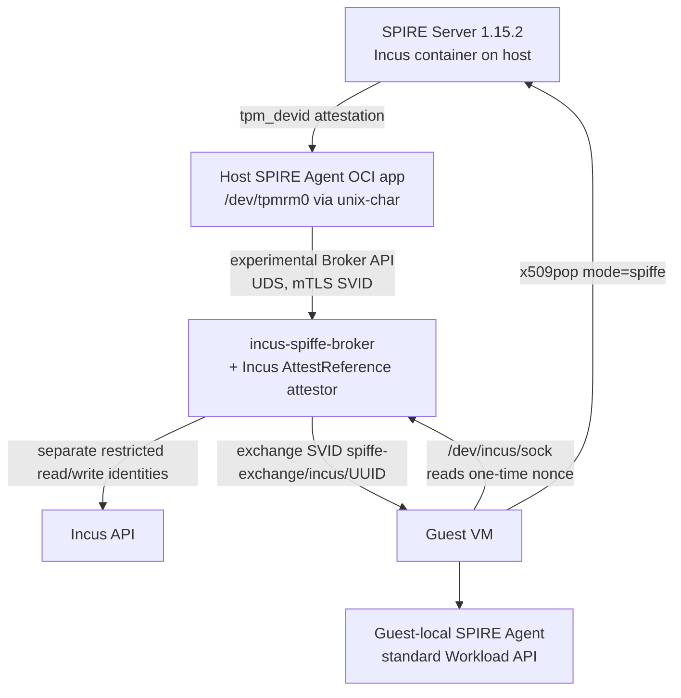
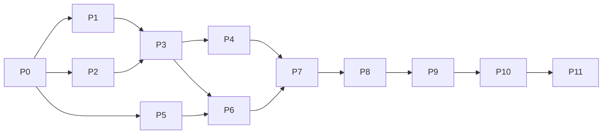

# SPIKE_PLAN — End-to-End SPIRE Integration on OVH IncusOS Bare Metal

**Session:** 001 · **Status:** G0 passed · P1 passed · P2 passed · **P3 passed / G3 PASSED 2026-08-16** · **Date:** 2026-08-15 · **Evidence:** [`p0`](evidence/p0/EVIDENCE.md), [`p1`](evidence/p1/EVIDENCE.md), [`p2`](evidence/p2/EVIDENCE.md), [`p3`](evidence/p3/EVIDENCE.md)
**Target host:** `ovh-incusos` → `ns1001912.ip-147-135-105.us` (`https://147.135.105.83:8443`)
**Pinned versions:** IncusOS `202608102114`, Incus `7.3`, SPIRE `1.15.2` (server, agent, plugin SDK — pin by image digest once resolved)

---

## 1. Objective

Prove, on the existing OVH bare-metal IncusOS host with its **physical TPM 2.0**, that the previously agreed Incus-level SPIRE architecture is viable end to end:

1. Host identity: upstream SPIRE Agent OCI application + `/dev/tpmrm0` passthrough + `tpm_devid` node attestation against a physical TPM.
2. Guest identity: SPIRE v1.15.2 experimental Broker API + a custom Incus-aware `AttestReference` workload attestor deriving selectors from authoritative Incus state.
3. Guest end state: a guest-local SPIRE Agent bootstrapped via an Incus-authenticated one-time nonce and `x509pop mode="spiffe"` exchange, serving the standard Workload API inside the VM.

The spike answers empirical questions; it does not build production software. Durable code lands in `componere/incusos-spire` only behind passed gates (Appendix C).

## 2. Architecture Under Test

No Workload API proxying across the host/guest boundary — proxying destroys original peer credentials (fixed prior decision).

## 3. Fixed Facts (established evidence — do not re-prove)

| Fact | Source |
|---|---|
| IncusOS `202608102114` / Incus `7.3` on OVH; Secure Boot with IncusOS PK/KEK/db; physical TPM 2.0 fw `1.3`, `tpm_status: ok`; `system_state_is_trusted: true`; root+swap `unlocked (TPM)`; ZFS `local`; `incusbr0` 10.55.156.1/24; empty workload list | `ovh` TECH_NOTES + live check before delegation |
| Recovery keys retrieved and stored outside repos; values must never appear anywhere in spike output | `ovh` runbook + context bundle |
| **KVM works: empty x86_64 Incus VM reached RUNNING (QEMU PID, TAP) and was cleanly deleted.** Treated as closed — no repeat smoke test | notes 2026-08-15 20:10 |
| Upstream `ghcr.io/spiffe/spire-agent:1.15.2` runs unmodified as an IncusOS OCI application | Mac lab (functional evidence only) |
| Incus `unix-char` passes `/dev/tpmrm0` into an OCI app container; `tpm2_getcap` / `tpm2_pcrread sha256:0,7` work inside; survives container restart and IncusOS reboot | Mac lab |
| Mac lab used an IBM software TPM — no physical-TPM security evidence carries over | notes |
| Single-node host: no Incus cluster, so real cluster-member migration is untestable here (see P10 limitation) | live host facts |

## 4. Hypotheses (what the spike must confirm or refute)

- **H1** — The physical TPM exposes an EK certificate whose manufacturer chain can be assembled into a `endorsement_ca_path` bundle that SPIRE Server accepts for proof-of-residency.
- **H2** — A TPM-resident LDevID key + certificate can be provisioned producing exactly the artifacts the agent plugin consumes (`devid_cert_path`, `devid_priv_path`, `devid_pub_path`), without disturbing IncusOS's TPM-sealed disk unlock.
- **H3** — `tpm_devid` attestation on the physical TPM succeeds inside the OCI app container and survives agent restart and full host reboot.
- **H4** — LDevID provisioning can be done with **zero persistent TPM footprint** (key blobs on disk, loaded transiently under a recreatable primary), i.e. no persistent handles or NV writes at all. [ASSUMPTION — the file-blob interface of the agent plugin suggests this; must be verified against the chosen provisioning tool. If false, fall back to a single pre-verified free persistent handle.]
- **H5** — Incus authorization can give the attestor read-only instance access while a separate bootstrap-writer identity can set or clear only `user.spiffe-bootstrap` in the managed project.
- **H6** — SPIRE Agent's experimental Broker API accepts a custom `type_url` reference and routes it to an external `AttestReference` workload attestor plugin.
- **H7** — `user.spiffe-bootstrap` via `/dev/incus/sock` gives replay-resistant, wrong-instance-proof guest binding, and `volatile.uuid` / `volatile.uuid.generation` behave as documented across clone/snapshot/restore.
- **H8** — A broker-issued `spiffe://<td>/spire-exchange/incus/<uuid>` SVID can be exchanged by a guest agent via `x509pop` `mode = "spiffe"` for a node identity, after which the guest Workload API is fully standard.

## 5. Safety Invariants (binding for every phase)

IncusOS root/swap decryption depends on the **same physical TPM**. A TPM mistake can render the host unbootable without the recovery key.

**Never, under any circumstances:**
- `tpm2_clear`; any platform/owner/endorsement/lockout hierarchy reset or auth change without a separately approved recovery procedure; firmware TPM reset.
- Broad persistent-object eviction or NV-index cleanup; any `tpm2_evictcontrol`/`tpm2_nvundefine` against a handle not created by this spike.
- Writing to any NV index or persistent handle not on the spike allocation record.
- Copying recovery keys, private keys, TPM blobs, nonces, or provisioning secrets into either repository, journal, evidence files, or agent output.

**Always:**
- Gate G0 must pass before the first mutating TPM command (see P0).
- After every phase that mutated TPM namespace state (persistent handles or NV indices), TPM hierarchy state, or boot-relevant host policy: reboot the host once and verify IncusOS returns to `tpm_status: ok`, `system_state_is_trusted: true`, root/swap `unlocked (TPM)`. Ordinary Incus mutations do not trigger this safety reboot. Reboots elsewhere in the plan are functional tests. A failed unlock is an immediate full stop: invoke the recovery-key procedure and do not improvise TPM commands.
- Watch dictionary-attack lockout: record `lockoutCounter`/`maxAuthFail` in P0; never retry a failed authorized TPM command in a loop.
- Every created object (Incus instance, volume, image, TPM object, SPIRE entry, Incus trust identity) is appended to the Teardown Inventory (Appendix E) at creation time.

## 6. Non-Goals

- No IncusOS fork, no custom IncusOS image, no embedded SPIRE application (fixed decision).
- No measured-boot / PCR-quote attestation (Claim B) — later extension only.
- No production PKI, HA SPIRE topology, CA rotation design, or multi-host clustering.
- No Workload API proxy across host/guest.
- No production-grade broker implementation before its empirical questions are answered.
- No re-validation of Mac-lab functional results or the OVH KVM smoke test.

---

## 7. Phases

Legend: every phase records evidence under `.journal/001/evidence/pN-*/` (journal worktree). "Throwaway" = shell/config kept only as evidence transcripts; "durable" = code in `componere/incusos-spire` per Appendix C. Cleanup owner is the person/agent executing the phase; cleanup executes before the phase is declared closed unless a later phase explicitly consumes the state (noted per phase).

### P0 — Recovery readiness, baseline capture, TPM read-only inventory

- **Question:** Is it safe to mutate this TPM at all, and what namespace is free for spike objects? Does the TPM expose an EK certificate and manufacturer chain (H1 discovery half)?
- **Topology introduced:** One throwaway Incus OCI container (`spike-tpm-inspect`, Debian + `tpm2-tools`) with `/dev/tpmrm0` via `unix-char` — read-only usage only. No SPIRE components.
- **Prerequisites:** `ovh-incusos` remote reachable; recovery keys confirmed present in the password manager (verify retrievability, never echo values); maintenance window allowing one controlled reboot.
- **Exact work:**
  1. Record IncusOS security baseline (TPM status, trust state, encryption state) and Incus state (`incus info`, storage, networks, empty instance list).
  2. Read-only TPM inventory inside the container: `tpm2_getcap properties-fixed` (manufacturer, vendor, firmware), `properties-variable` (ownerAuthSet/endorsementAuthSet/lockoutAuthSet flags, lockoutCounter, maxAuthFail), `algorithms`, `pcrs` (banks), `handles-persistent`, `handles-nv-index`, `tpm2_nvreadpublic`.
  3. EK discovery: read the TCG-standard EK certificate NV indices (RSA `0x01C00002`, ECC `0x01C0000A`) with `tpm2_nvread` where defined. Extract the public key, subject, and issuer from the certificate without creating a TPM object. Attempt to assemble the manufacturer CA bundle from the vendor's published roots.
  4. Select a spike TPM namespace: confirm target persistent-handle candidates (owner range `0x8101xxxx`) and NV candidates are absent from the inventory; record the allocation table (even if H4 later makes it unnecessary).
  5. Write the rollback condition record: exact deletion command per prospective object class, the reboot-verification procedure, and the stop conditions below.
- **Expected evidence:** `p0-baseline.md` (host security state), `p0-tpm-inventory.md` (full capability/handle dump — public data only), `p0-ek-chain.md` (EK cert subject/issuer, chain assembly result — no private material), `p0-namespace.md` (allocation + rollback record).
- **Acceptance (Gate G0 — unlocks any mutating TPM action):**
  1. Recovery readiness confirmed (keys retrievable; procedure written down by reference, not value).
  2. Complete persistent-handle and NV-index inventory captured.
  3. Collision-free spike namespace recorded.
  4. Rollback conditions and reboot-verification procedure recorded.
  5. Hierarchy auth posture understood: if owner/endorsement hierarchy auths are set and unknown, that is a **stop**, not a workaround (the agent plugin's `owner_hierarchy_password` / `endorsement_hierarchy_password` config fields exist but we have no authorized value).
- **Failure interpretation:** No EK cert in NV and no vendor chain obtainable → H1 at risk; proceed to P1 only for provisioning mechanics, and open the architecture-contradiction path (§10): `tpm_devid` proof-of-residency requires `endorsement_ca_path` chain validation on the server, so a missing endorsement chain invalidates the physical-host-identity claim; safest fallback is host `x509pop` (weaker, no hardware residency proof) pending vendor EK-cert retrieval by EK public key.
- **Rollback/cleanup:** Delete `spike-tpm-inspect`. Nothing else was created. **Stop condition:** unknown hierarchy auth; nonzero/climbing lockout counter; inventory shows unexpected rich persistent state suggesting IncusOS actively manages TPM objects we cannot safely coexist with.
- **Decision gate:** G0 pass → P1 and P2 may start (P2 has no TPM dependency and may start in parallel once P0 baseline exists).

### P1 — Spike PKI and LDevID provisioning (first mutating TPM phase)

- **Question:** Can we provision a TPM-resident LDevID producing exactly `devid.pem` + private/public blobs consumable by the agent plugin (H2), with minimal or zero persistent TPM footprint (H4)?
- **Topology introduced:** Throwaway spike CA (offline, disposable — two-tier: spike root + DevID issuing CA; keys live only on an encrypted spike volume, destroyed at teardown). Throwaway enrollment container (`spike-devid-enroll`) with `/dev/tpmrm0`.
- **Prerequisites:** Gate G0 passed. Candidate tooling selected: primary candidate is the HPE `devid-provisioning-tool` from the SPIFFE ecosystem [ASSUMPTION — its output format compatibility with SPIRE 1.15.2 blob loading must be verified; fallback is a small throwaway Go program using the same TPM libraries as SPIRE's `tpm_devid` implementation at `spire/pkg/agent/plugin/nodeattestor/tpmdevid`].
- **Exact work:**
  1. Stand up the disposable CA; document what is disposable (all of it) versus persistent (nothing beyond the spike).
  2. Create a transient EK with `tpm2_createek`, compare its public key with the EK certificate discovered in P0, and flush it. Do not persist the EK.
  3. In the enrollment container, create the TPM-bound DevID key, generate the CSR, sign it with the spike DevID CA, and emit `devid.pem`, `devid-private.blob`, and `devid-public.blob` onto the dedicated `spike-spire-agent-state` volume.
  4. Record precisely which TPM objects the tool created. Reconcile transient objects, persistent handles, and NV writes against the P0 inventory. This diff is the H4 verdict.
  5. If persistence was required, confirm it used only the pre-approved handle from the P0 allocation table; otherwise abort and rerun with explicit constraints.
  6. Reboot the host once; verify the IncusOS trusted-unlock invariant; verify the blobs still load under the recreated parent or with the provisioning tool's self-check.
- **Expected evidence:** `p1-provisioning.md` (tool, exact commands with secrets redacted, TPM object diff), `p1-reboot-check.md`. Certificates (public) may be included; **no private keys or blobs in the journal** — blobs stay on the spike volume only.
- **Acceptance:** Valid LDevID chain to the spike DevID CA; blob triplet present on the spike volume; TPM diff shows only approved objects (ideally none); post-reboot invariant holds.
- **Failure interpretation:** Tool incompatibility → try fallback tool before concluding. Provisioning demands hierarchy auth we don't have → stop (G0 stop condition re-triggered). Blob load fails after reboot → H4 false in a deeper way (parent key not recreatable) → evaluate one persistent parent at the approved handle.
- **Rollback/cleanup (owner: executor, before phase close except artifacts consumed by P3):** delete `spike-devid-enroll`; keep the spike volume, CA, and any approved handle that P3 requires. Evict only a spike-created handle that is recorded as unnecessary. Remove any retained spike handle in P11 by its exact recorded handle. **Stop conditions:** any prompt to touch hierarchy auth, lockout counter movement, or a tool wanting NV/persistent writes outside the allocation table.
- **Decision gate:** H2 (and H4 verdict) recorded → P3 unblocked once P2 is up.

### P2 — SPIRE Server placement and configuration (parallel to P1)

- **Question:** Where does the spike SPIRE Server run and what server-side `tpm_devid` configuration does it need?
- **Topology introduced:** `spire-server` as an Incus OCI application container on the OVH host (`ghcr.io/spiffe/spire-server:1.15.2` pinned by digest), dedicated volume `spike-spire-server-state` (sqlite datastore), reachable from `incusbr0`. Trust domain: `spike.incus.internal` [arbitrary spike-only choice]. Running the server on the same host is a spike convenience, not an architecture claim — note in evidence.
- **Prerequisites:** P0 baseline. Container, image, volume, and base configuration preparation may run in parallel with P1. Final `tpm_devid` configuration requires the public spike DevID CA bundle from P1 and the manufacturer EK chain bundle from P0.
- **Exact work:** Configure server `NodeAttestor "tpm_devid"` with `devid_ca_path` set to the spike DevID CA bundle and `endorsement_ca_path` set to the manufacturer bundle. Configure the `x509pop` server plugin now but leave it unused until P9; set `mode = "spiffe"` and preserve the documented defaults for `svid_prefix` and `agent_path_template`. Verify the health endpoint and empty agent list.
- **Expected evidence:** `p2-server.md` — sanitized `server.conf`, container config, health output.
- **Acceptance:** Server healthy across container restart and host reboot; config loads both CA bundles.
- **Failure interpretation:** Pure deployment issues; no architectural signal.
- **Rollback/cleanup:** `spire-server` container + volume on teardown inventory; deleted in P11.
- **Decision gate:** Together with P1 → unlocks P3.

### P3 — Host SPIRE Agent + physical `tpm_devid` attestation (**critical gate**)

- **Question:** Does physical-TPM `tpm_devid` node attestation work end to end, positively and negatively, and persist across restart/reboot (H3)? **No Broker or custom-plugin work may begin before this gate passes.**
- **Topology introduced:** `spire-agent` Incus OCI application (`ghcr.io/spiffe/spire-agent:1.15.2` pinned by digest) with `/dev/tpmrm0` (`unix-char`, options as proven on Mac lab), `spike-spire-agent-state` volume mounted (blobs + agent data dir for SVID cache).
- **Prerequisites:** P1 artifacts, P2 server. Agent config uses the documented fields: `tpm_device_path = "/dev/tpmrm0"`, `devid_cert_path`, `devid_priv_path`, `devid_pub_path` (hierarchy passwords empty per P0 posture).
- **Exact work:**
  1. Positive: agent attests; server shows node `spiffe://spike.incus.internal/spire/agent/tpm_devid/<fingerprint>`; record server-emitted selectors (`tpm_devid:subject:cn`, `tpm_devid:issuer:cn`, `tpm_devid:fingerprint:*`).
  2. Persistence: agent container restart; then full host reboot → agent returns to attested state without manual action; TPM-unlock invariant verified after reboot.
  3. Negative set (each must fail, each teardown restores the working state): (a) DevID cert signed by an untrusted CA → server rejects at proof-of-possession chain check; (b) a disposable foreign-TPM DevID triplet, created for this test with the P1 tooling against a non-OVH software TPM and signed by the spike DevID CA so only residency differs → proof-of-residency fails (different TPM/EK); destroy this triplet immediately after the test; (c) agent without `/dev/tpmrm0` attached → attestation cannot complete; (d) tampered `devid.pem` → rejected.
- **Expected evidence:** `p3-attestation.md` (agent+server logs excerpts, node entry, selectors), `p3-persistence.md`, `p3-negative.md` (one subsection per case with the exact rejection).
- **Acceptance (Gate G3):** All positive + persistence checks pass; all four negative cases fail for the documented reason; post-reboot invariant holds.
- **Failure interpretation:** PoP failure → P1 chain problem. PoR failure with correct blobs → H1 endorsement-chain problem (architecture contradiction path §10). Restart flakiness → agent data-dir/persistence configuration, not architecture.
- **Rollback/cleanup:** Negative-case artifacts (bad certs/blobs) deleted immediately; agent container/volume persists for later phases (on teardown inventory).
- **Decision gate:** **G3 pass = the host identity claim is proven; custom Incus attestor/Broker development is now permitted.** G3 fail on PoR = stop and resolve H1 before any further spend.

### P4 — Standard Workload API baseline on the host (pre-Broker control)

- **Question:** Does the stock Workload API behave normally from the host agent before any Broker customization (control experiment for later diffing)?
- **Topology introduced:** One throwaway workload container/process context reaching the agent's Workload API socket (exposed only on the spike volume/socket path — never network-broad).
- **Prerequisites:** G3.
- **Exact work:** Register a trivial entry parented to the tpm_devid node (e.g. `unix` attestor selector), fetch an SVID with `spire-agent api fetch x509`, record rotation behavior briefly.
- **Expected evidence:** `p4-workload-api.md`.
- **Acceptance:** SVID issued with expected SPIFFE ID; rotation ticks.
- **Failure interpretation:** Agent/registration misconfiguration; fix before Broker work to keep P7 diagnosable.
- **Rollback/cleanup:** Delete the test entry and workload.
- **Decision gate:** Baseline recorded → P7 may start (with P5/P6).

### P5 — Incus API authentication and least-privilege model (parallel track; may start after P0)

- **Question:** What is the minimum Incus authorization surface that lets the attestor independently resolve instance UUID → verified metadata (H5)?
- **Topology introduced:** A dedicated spike Incus project (`spike-spiffe`) and two restricted TLS identities: `spike-attestor-ro` for read-only instance queries, and `spike-bootstrap-writer` only for setting or clearing `user.spiffe-bootstrap` on instances in that project. The attestor never holds config-write privilege. No TPM involvement.
- **Prerequisites:** P0 baseline only.
- **Exact work:**
  1. Enumerate the attestor reads: instance existence by `volatile.uuid`, project, type, status, location, `volatile.uuid.generation`, and image fingerprint. Assign these operations to `spike-attestor-ro`.
  2. Separately enumerate the bootstrap write: set or clear `user.spiffe-bootstrap` in `spike-spiffe`. Assign this operation only to `spike-bootstrap-writer`.
  3. Test restriction mechanisms in order of simplicity: project-restricted TLS certificates, then Incus fine-grained authorization if project confinement is too coarse. Record what Incus 7.3 can express. [ASSUMPTION to verify live: exact granularity for read-only instance access and a single config-key write.]
  4. Adversarial checks: both identities must fail to create or delete instances, read other projects, or read host resources. `spike-attestor-ro` must fail every write, including `user.*`; `spike-bootstrap-writer` must fail every read or write beyond the bootstrap key in the spike project.
- **Expected evidence:** `p5-authz.md` — required-operations table, mechanism matrix, transcripts of allowed/denied calls.
- **Acceptance:** Produce two separate credential recipes with no shared key material. The desired result is read-only instance access for `spike-attestor-ro` and only the bootstrap-key mutation for `spike-bootstrap-writer`. If Incus cannot express either exact grant, record the smallest achievable grant and every residual permission.
- **Failure interpretation:** An over-broad grant does not stop the functional spike, but it is a go/no-go input. Never collapse the two identities or give the attestor write privilege to bypass an authorization limitation.
- **Rollback/cleanup:** Revoke both spike identities and delete the project at teardown.
- **Decision gate:** Credential recipe feeds P6/P7/P8.

### P6 — Incus selector derivation and plugin boundary (design-by-experiment)

- **Question:** What does authoritative Incus state actually contain for identity purposes, and what is the minimal `IncusInstanceReference` schema and selector set (H7 discovery half)?
- **Topology introduced:** One throwaway guest VM in `spike-spiffe` (created and destroyed within the phase); throwaway query scripts using `spike-attestor-ro`. No SPIRE changes.
- **Prerequisites:** P5 read-only attestor credential; G3 (ordering rule: no custom-plugin development before the host chain is proven).
- **Exact work:**
  1. Empirically observe `volatile.uuid` and `volatile.uuid.generation` across: create, stop/start, snapshot+restore, copy (clone), rename, delete+recreate-same-name. Record actual behavior rather than assuming docs (clone UUID regeneration behavior is a to-verify item).
  2. Freeze the reference schema from observations — working draft: `server`, `project`, `instance_uuid`, `generation_uuid` — and the selector set (`incus:uuid`, `incus:generation`, `incus:project`, `incus:type`, `incus:name` [informational only], `incus:image`).
  3. Define the plugin boundary for durable code (Appendix C): pure selector-derivation core behind an Incus read port; the external SPIRE plugin binary is an adapter.
- **Expected evidence:** `p6-uuid-semantics.md` (lifecycle observation table), `p6-reference-schema.md`.
- **Acceptance:** Every selector traceable to an observed, authoritative Incus field; rollback-sensitive semantics of `generation_uuid` confirmed by experiment.
- **Failure interpretation:** If `volatile.uuid` is not stable/unique as documented, the reference anchor is wrong — architecture contradiction path (§10) with candidate fallback anchors recorded from observation.
- **Rollback/cleanup:** Delete the observation VM and snapshots within the phase.
- **Decision gate:** Schema frozen → P7 implementation may begin.

### P7 — Broker API integration (experimental-surface isolation)

- **Question:** Does the v1.15.2 agent Broker API accept our custom reference type and route it to our external `AttestReference` attestor, producing independently derived selectors and an SVID (H6)?
- **Topology introduced:** First durable code: minimal `incus` external WorkloadAttestor plugin (implements `AttestReference` from the workloadattestor v1 SDK) delivered into the agent container via a mounted volume or a thin derived image [decision point D1 — record which]; agent config gains `experimental { broker { socket_path = "<uds>" , brokers = [{ id = "spiffe://spike.incus.internal/incus-broker", allowed_reference_types = [{ type_url = "type.googleapis.com/componere.incus.v1alpha1.IncusInstanceReference" }] }] } }` (UDS only; do **not** set `bind_address`/`allow_over_tcp` in the spike). Broker client role initially played by an operator harness with an SVID from P4's mechanism.
- **Prerequisites:** G3, P4 baseline, P5 read-only attestor credential, P6 schema. Version pins verified: server, agent, and SDK all v1.15.2.
- **Exact work:**
  1. Implement the plugin skeleton per Appendix C; wire `plugin_cmd` and `plugin_checksum` in agent config [standard SPIRE external-plugin mechanism — stable surface].
  2. Create a broker registration entry parented to the physically attested host node. Use a selector for the actual broker process and obtain the harness's broker SVID through the standard host Workload API.
  3. Drive the endpoint manually first (`grpcurl -unix -rpc-header 'broker.spiffe.io: true' …`) to confirm reflection and authentication behavior, including the mandatory `broker.spiffe.io: true` metadata header. Requests without the header are rejected with `InvalidArgument` in v1.15.2.
  4. Positive: the operator broker submits `IncusInstanceReference{uuid}` for a live observation VM; the plugin queries Incus with `spike-attestor-ro`; selectors match a registration entry; SPIRE issues the SVID.
  5. Failure isolation: reject an unauthorized broker SPIFFE ID at TLS; reject an authorized broker with a disallowed `type_url` with `PermissionDenied`; return no selectors or SVID for a nonexistent UUID; turn an Incus API outage into a bounded attestation failure rather than a hang.
  6. Record the experimental-risk containment contract: pin by digest; isolate all Broker-facing code behind one internal adapter; on every SPIRE bump, rerun this phase's acceptance set before adoption. If the Broker API breaks, the documented but unbuilt fallback is the Delegated Identity API with broker-supplied selectors; this weakens the trust split.
- **Expected evidence:** `p7-broker.md` (config, grpcurl transcripts, positive issuance, all rejection cases with gRPC codes).
- **Acceptance:** SVID issued from a UUID reference with selectors derived only by the plugin from live Incus state; all four failure-isolation cases behave as documented.
- **Failure interpretation:** If the agent cannot route a vendor `type_url` to an external attestor in 1.15.2 (upstream behavior gap vs. docs), that is the highest-severity architecture contradiction (§10): fallbacks are (a) Delegated Identity API, (b) direct server-API minting by a trusted broker — both weaken the independent-attestation property and force a go/no-go discussion.
- **Rollback/cleanup:** Test registration entries deleted; broker harness SVIDs expire naturally; plugin binary/volume on teardown inventory.
- **Decision gate:** H6 proven → guest-facing work (P8) unlocked.

### P8 — Guest VM binding and one-time nonce lifecycle

- **Question:** Can a guest be securely and uniquely bound to its Incus instance via `/dev/incus/sock` + `user.spiffe-bootstrap`, with single-use and expiry enforced (H7)?
- **Topology introduced:** Guest VM `spike-guest-a` (Debian/Ubuntu from `images:`) in `spike-spiffe`; minimal durable broker bootstrap service (`incus-spiffe-broker`) listening on `incusbr0` (its own container IP), TLS with a spike-issued server cert, and a dedicated state volume for nonce hashes and bindings. The broker writes `user.spiffe-bootstrap = {nonce, nonce-id, broker URL, broker cert fingerprint}` to the instance config [proposal from the evaluation]. Only that instance can retrieve the value through its own `/dev/incus/sock`. The secret is random, short-lived, single-use, and bound server-side to one `instance_uuid` plus `generation_uuid` for VMs.
- **Prerequisites:** P7; the separate P5 bootstrap-writer credential; P6 semantics.
- **Exact work:**
  1. Nonce issuance: the broker mints a high-entropy nonce, stores only its hash with `{uuid, generation, expiry, used=false}`, and writes the bootstrap config key.
  2. Redemption: the guest reads its key through `/dev/incus/sock`; the broker validates the nonce and resolves its bound UUID through the P7 path.
  3. Consume atomically: use one compare-and-set transaction so concurrent redemption attempts yield exactly one success. Commit `used=true` before clearing the instance config key; a crash between those operations leaves a harmless consumed value, not a reusable credential.
  4. Lifecycle checks: expiry honored; second redemption rejected; two concurrent redemptions produce one success; nonce for a deleted instance rejected; nonce invalidated when `generation_uuid` changes.
  5. Wrong-instance check: `spike-guest-b` cannot read A's nonce through its own `/dev/incus/sock`. If B supplies its own nonce while requesting A's UUID, the broker ignores the claimed UUID and resolves only B, so B cannot obtain A's identity. A deliberately leaked, unused A nonce is a bearer credential and can impersonate A unless the prototype adds another caller-binding mechanism; measure and record that limitation instead of expecting rejection.
- **Expected evidence:** `p8-nonce.md` (issue, redeem, concurrent consume, expire, reuse, wrong-instance, deletion, and generation-change results; nonce values redacted).
- **Acceptance:** Positive redemption, atomic single use, expiry, generation invalidation, and the non-leaked wrong-instance case behave as designed; no nonce value appears in logs or evidence. The unused-token theft result is an explicit bearer-token risk and go/no-go input.
- **Failure interpretation:** If `/dev/incus/sock` visibility or `user.*` semantics differ from expectation, re-derive the side channel (candidates: cloud-init vendor data, vsock) — record as design change, not silent patch.
- **Rollback/cleanup:** Config keys cleared even on abort (cleanup owner script); guests persist into P9.
- **Decision gate:** Binding proven → P9.

### P9 — Guest `x509pop` bootstrap, guest-local SPIRE Agent, guest Workload API

- **Question:** Can nonce redemption yield a broker-obtained exchange SVID that the guest agent exchanges via `x509pop` `mode="spiffe"` for a node identity, ending in a standard in-guest Workload API (H8)?
- **Topology introduced:** Guest-local `spire-agent` 1.15.2 in `spike-guest-a`; server `x509pop` activated with `mode = "spiffe"`, `svid_prefix = "/spire-exchange"`, and the documented v1.15.2 default `agent_path_template = "{{ .PluginName }}/{{ .SVIDPathTrimmed }}"`. That default maps `spiffe://<td>/spire-exchange/incus/<uuid>` to `spiffe://<td>/spire/agent/x509pop/incus/<uuid>`. Do not introduce a custom template unless P9 verifies it against the v1.15.2 template documentation. Broker requests the exchange SVID `spiffe://spike.incus.internal/spire-exchange/incus/<uuid>` through the Broker API against a registration entry keyed on `incus:uuid:<uuid>`.
- **Prerequisites:** P8.
- **Exact work:**
  1. On successful nonce redemption, broker returns the short-lived exchange SVID + key to the guest over the authenticated bootstrap channel; guest agent starts with `x509pop` using that certificate/key; server verifies chain against its own trust bundle (mode `spiffe`) and proof-of-possession; guest becomes node `spiffe://spike.incus.internal/spire/agent/x509pop/incus/<uuid>`.
  2. Record exactly how the exchange key is delivered/held (memory-only vs disk, TTL) — this is a known-unsolved design point; the spike documents the tradeoff rather than declaring it solved.
  3. Register a guest workload entry (guest `unix` attestor); an in-guest app fetches its SVID from the local Workload API; verify rotation.
  4. Guest reboot and guest agent restart: define and verify the intended re-attestation story (fresh nonce per boot vs agent SVID persistence) — record the observed behavior for the go/no-go.
- **Expected evidence:** `p9-guest-bootstrap.md` (full chain transcript, node entry, guest workload SVID, reboot behavior).
- **Acceptance:** An in-guest app obtains the expected SVID from a standard local Workload API. The issuance path requires the physically attested host agent, an authorized broker SVID, and selectors independently derived from the authoritative Incus instance record; the SPIFFE trust chain remains rooted in the SPIRE trust domain.
- **Failure interpretation:** `x509pop` prefix/template mismatches are configuration, not architecture. Inability to deliver the exchange credential without unacceptable exposure is a design finding for go/no-go.
- **Rollback/cleanup:** Guest agent state on guest disk only; guests persist into P10.
- **Decision gate:** H8 proven → adversarial matrix.

### P10 — Adversarial and lifecycle matrix

- **Question:** Does the whole chain hold under the required positive and adversarial lifecycle events?
- **Topology introduced:** Second guest `spike-guest-b` (from P8), plus snapshots/clones created and destroyed per case.
- **Prerequisites:** P9 complete and stable.
- **Exact work — required case matrix (each case: setup → action → expected → observed → cleanup):**
  | # | Case | Expected outcome |
  |---|---|---|
  | 1 | Host reboot | Host agent re-attests via `tpm_devid`; guests recover per P9 §4 story; TPM-unlock invariant re-verified |
  | 2 | Host agent container restart | Node identity continuity; broker reconnects to Broker UDS |
  | 3 | Guest reboot / guest agent restart | Behavior matches the P9-defined re-attestation story |
  | 4 | Nonce replay (reuse after redemption) | Rejected (P8 re-run within full chain) |
  | 5 | Wrong instance | B cannot read A's nonce; B's own nonce cannot request A's identity. Separately record that theft of an unused A bearer nonce can impersonate A unless an additional caller-binding mechanism is proven |
  | 6 | Clone (`incus copy` of A) | Clone's UUID/selector outcome matches P6 observation; clone cannot assume A's identity |
  | 7 | Snapshot A → restore | `generation_uuid` change invalidates outstanding bootstrap/exchange state; restored guest must re-bootstrap; stale in-guest SVIDs expire and are not renewable via old credentials |
  | 8 | Migration | **Untestable on this single node** — real cluster-member migration deferred; run the closest proxies (project move / stopped export+import) and record UUID/generation effects; mark as an explicit conditional in go/no-go |
  | 9 | Deletion, then recreate same name | New instance gets a new UUID; old registration entries/nonces do not apply; name-based confusion impossible because name is never an anchor |
  | 10 | Stale credentials | Expired nonce, expired exchange SVID, and revoked/deleted registration entry each fail cleanly with recorded errors |
- **Expected evidence:** `p10-matrix.md` — one section per case; plus updated `p6` observation table where new lifecycle data emerged.
- **Acceptance:** Cases 1–4, 6–7, and 9–10 pass. Migration case 8 is documented as deferred with proxy results. For case 5, B cannot obtain A's identity using B's own material or a claimed UUID; the deliberately stolen unused-token subcase produces the documented bearer-token finding.
- **Failure interpretation:** Impersonation with the attacker's own instance material or replay of a consumed/expired credential is a blocking failure. Successful use of a deliberately stolen, still-unused bearer nonce confirms the explicit token-theft risk and requires either additional binding or documented risk acceptance. Lifecycle rough edges such as manual re-bootstrap after restore are findings, not blockers, when they fail closed.
- **Rollback/cleanup:** All clones/snapshots deleted per case; both guests deleted at the end of P10.
- **Decision gate:** Matrix results feed §9 go/no-go directly.

### P11 — Teardown and architecture go/no-go

- **Question:** Is the host returned to its pre-spike state, and does the evidence support adopting the architecture?
- **Exact work:** Execute the Teardown Inventory (Appendix E) in order; final host reboot; verify: empty workload list (except anything explicitly retained by decision), `tpm_status: ok`, `system_state_is_trusted: true`, root/swap `unlocked (TPM)`, TPM handle/NV inventory identical to `p0-tpm-inventory.md`. Compile the evidence matrix (Appendix B) and write the go/no-go record.
- **Acceptance:** Post-teardown inventory diff is empty; go/no-go record complete.
- **Cleanup owner:** Executor; this phase *is* cleanup.

---

## 8. Dependency Graph / Critical Path

**Critical path:** P0 → P1 → P3 → P7 → P8 → P9 → P10 → P11. P2 and P5 are parallelizable; P6 needs both G3 and P5. The first executable slice is exactly **P0 → P1 → P2 → P3**: prove safe physical-TPM `tpm_devid` before any custom Broker/plugin construction.

## 9. Final Architecture Go/No-Go Criteria

**GO requires all of:**
1. G3 passed on the physical TPM (H1–H3), including endorsement-chain validation (`endorsement_ca_path`) — no degraded/`x509pop` host fallback in effect.
2. H6 proven on pinned v1.15.2 with all four Broker failure-isolation behaviors observed.
3. P10 cases 4, 7, 9, and 10 fail closed. Case 5 proves that B cannot obtain A's identity with B's own bootstrap material or a claimed UUID. Any risk from theft of A's still-unused bearer nonce is either mitigated with an additional binding or explicitly accepted with the nonce's entropy, short TTL, single-use semantics, and isolation documented.
4. Least-privilege result (P5) with residual over-grant judged acceptable and recorded.
5. Post-teardown TPM inventory identical to baseline; IncusOS trusted unlock intact throughout (zero recovery-key events).

**Conditional items allowed in a GO:** migration (#8) deferred pending a cluster; exchange-credential delivery hardening (P9 §2) listed as pre-production work; Broker API re-validation required on every SPIRE upgrade.

**NO-GO triggers:** endorsement chain unobtainable (H1 false) with vendor retrieval exhausted; Broker API cannot route vendor reference types (H6 false) and the Delegated Identity fallback's weaker trust split is deemed unacceptable; cross-instance impersonation without possession of the target instance's unredeemed secret; unacceptable exposure of that bearer secret; any TPM-safety incident.

## 10. Architecture-Contradiction Protocol

The standing decision (Incus-level integration, no forks) is preserved unless a phase produces a direct contradiction. If so: record the exact contradiction (phase, hypothesis, observed evidence), stop dependent phases, and evaluate the pre-identified safest alternative — (a) H1 false → host `x509pop` with hardware residency deferred; (b) H6 false → Delegated Identity API adapter; (c) H7 false → alternative guest side channel (cloud-init/vsock). Any alternative adoption is a go/no-go input, never a silent substitution.

---

## Appendix A — Risk Register

| ID | Risk | Likelihood | Impact | Mitigation |
|---|---|---|---|---|
| R1 | TPM mutation breaks IncusOS TPM unlock → unbootable host | Low | Critical | G0 gate; invariant reboot check per mutating phase; prohibited-command list; recovery key retrievable before P1 |
| R2 | EK certificate/manufacturer chain unavailable for this board's TPM | Medium | High | P0 discovery first; vendor EK-cert retrieval by EK pub; §10(a) fallback |
| R3 | Broker API is experimental in 1.15.2; breaking changes expected upstream | High (over time) | Medium | Digest pinning; single adapter isolation (Appendix C); P7 acceptance set as upgrade regression gate; documented Delegated Identity fallback |
| R4 | DevID provisioning tooling incompatible/unmaintained | Medium | Medium | Two-tool strategy in P1; blob-compat verification is the phase's first check |
| R5 | DA lockout triggered by repeated failed TPM auth | Low | High | Lockout counters recorded in P0; no retry loops; stop condition |
| R6 | Incus least privilege coarser than desired | Medium | Medium | Separate read-only attestor and bootstrap-writer identities; P5 records each smallest achievable grant; dedicated-project confinement is the floor |
| R7 | Exchange-credential delivery to guest exposes key material | Medium | Medium | P9 documents delivery/holding tradeoffs explicitly; pre-production hardening item |
| R8 | Single-node host cannot test migration | Certain | Low (spike) | Declared limitation; proxies in P10 #8; conditional go |
| R9 | Secret leakage into evidence/journal | Low | High | Appendix D rules; redaction checklist before every evidence commit |
| R10 | Theft of an unused bootstrap nonce allows guest impersonation because the nonce is a bearer credential | Low | High | Per-instance `/dev/incus/sock` isolation, high entropy, short TTL, single use, log redaction; test whether an additional caller-binding mechanism is required |

## Appendix B — Evidence Matrix (17 required coverage areas → phases)

| # | Coverage area | Phase(s) | Evidence artifact |
|---|---|---|---|
| 1 | Baseline + TPM read-only inventory | P0 | `p0-*` |
| 2 | Spike PKI + LDevID provisioning (disposable vs persistent) | P1 (+P0 EK) | `p1-*`, `p0-ek-chain.md` |
| 3 | SPIRE Server placement/config for `tpm_devid` | P2 | `p2-server.md` |
| 4 | Host agent OCI packaging + `/dev/tpmrm0` | P3 | `p3-attestation.md` |
| 5 | Positive/negative `tpm_devid`; restart/reboot persistence | P3 | `p3-persistence.md`, `p3-negative.md` |
| 6 | Standard Workload API pre-Broker | P4 | `p4-workload-api.md` |
| 7 | Incus API authn + minimum authorization | P5 | `p5-authz.md` |
| 8 | Selector derivation + plugin boundary | P6 | `p6-*` |
| 9 | Broker API integration, pinning, isolation, fallback/upgrade | P7 | `p7-broker.md` |
| 10 | Nested VM + authoritative instance binding | P8 (VM facts from P6) | `p8-nonce.md`, `p6-uuid-semantics.md` |
| 11 | One-time nonce lifecycle + secure delivery | P8 | `p8-nonce.md` |
| 12 | Guest `x509pop`, guest agent, guest Workload API | P9 | `p9-guest-bootstrap.md` |
| 13 | Replay/wrong-instance/clone/snapshot-restore/restart/reboot/migration/deletion/stale creds | P10 (+P8) | `p10-matrix.md` |
| 14 | Observability + evidence w/o secret leakage | All + Appendix D | evidence tree + redaction checklist |
| 15 | Cleanup + go/no-go | P11 | teardown diff + go/no-go record |
| 16 | Implementation artifacts / file targets | Appendix C | repo tree (post-gate) |
| 17 | Tests only for observable contracts | Appendix C §Tests | unit tests for frozen contracts only |

## Appendix C — Repository Artifact Targets (`componere/incusos-spire`, hexagonal per AGENTS.md A1–A4)

**Throwaway (never merged as product code):** `spike/` — configs, provisioning transcripts, operator harness scripts, sanitized `server.conf`/`agent.conf`; clearly labeled; deletable without loss (evidence lives in the journal).

**Durable (only after the owning gate passes; each package: `doc.go` per D4, Godoc per D1, mockery mocks per T2/T3):**

| Path | Contents | Gate |
|---|---|---|
| `proto/componere/incus/v1alpha1/reference.proto` | `IncusInstanceReference` (schema frozen in P6; `type_url` `type.googleapis.com/componere.incus.v1alpha1.IncusInstanceReference`) | P6 |
| `internal/attestor/` | Pure selector derivation plus the consumer-owned `InstanceReader` port; no I/O | P7 |
| `internal/incus/identity/` | Incus API adapter implementing `InstanceReader`; links only the `spike-attestor-ro` credential | P6/P7 |
| `internal/incus/bootstrap/` | Separate adapter implementing the bootstrap config-writer port; links only the `spike-bootstrap-writer` credential | P8 |
| `cmd/incus-attestor/` | External SPIRE WorkloadAttestor plugin binary (SDK v1.15.2, `AttestReference`); thin adapter over `internal/attestor` | P7 |
| `internal/nonce/` | Pure nonce lifecycle domain and consumer-owned bootstrap-writer port (mint, bind, expire, consume once, invalidate by generation); no I/O | P8 |
| `internal/nonce/sqlite/` | Conditional persistence adapter for atomic nonce consumption if P8 selects SQLite; add only after the storage experiment fixes the contract | P8 |
| `internal/broker/` | Sole adapter touching the experimental Broker API client surface (isolation for R3) | P7/P8 |
| `cmd/incus-spiffe-broker/` | Guest-facing bootstrap service; composes `internal/nonce`, `internal/incus/bootstrap`, and `internal/broker`. Whether this merges with the attestor binary is decision D1, resolved empirically in P7/P8 — do not pre-decide | P8/P9 |

**Tests (per area 17 / AGENTS.md T1):** add unit tests only for contracts frozen by experiments. `internal/nonce` covers atomic single use, expiry, generation invalidation, and rejection when B uses B's material to request A's identity. `internal/attestor` covers selector derivation from fixed instance records. Add integration tests with generated port mocks after P5 fixes each Incus surface. The phases are the end-to-end verification; do not add tests for `spike/` scripts.

## Appendix D — Secret-Handling Rules

1. Recovery-key values, TPM key blobs, private keys, hierarchy passwords, and nonce values never appear in either repository, the journal, evidence files, logs quoted into evidence, or agent output. Evidence quotes logs only after redaction.
2. Spike CA private keys and DevID blobs live only on dedicated spike Incus volumes; delete those volumes in P11. Do not claim cryptographic erasure unless the storage experiment proves it.
3. Evidence may contain: public certificates, SPIFFE IDs, fingerprints, selectors, gRPC status codes, config files with secret fields elided.
4. Pre-commit checklist for every evidence file: search for PEM `PRIVATE KEY` blocks, base64 blobs > 64 chars, and the strings `recovery`, `nonce=`; justify or remove each hit.
5. Nonce transcripts show nonce **IDs**/hashes, never values.

## Appendix E — Teardown Inventory (live document; append at creation time)

Ordered teardown classes (P11 executes top to bottom):
1. Guest instances + snapshots + clones (`spike-guest-*`) and their volumes.
2. Broker/attestor containers and binaries; test registration entries; SPIRE nodes (guest, then host) — server-side entries deleted before server removal.
3. Host `spire-agent` container; delete the `spike-spire-agent-state` volume that holds DevID blobs. Do not claim cryptographic erasure without evidence.
4. `spire-server` container + `spike-spire-server-state` volume; spike CA material.
5. Incus: `spike-spiffe` project, restricted TLS identities/certificates, any spike images, `user.*` keys anywhere left set.
6. TPM: evict/undefine **only** objects on the P1 allocation record (expected: none if H4 held), verified by diff against `p0-tpm-inventory.md`.
7. Final reboot + invariant check + baseline diff (P11 acceptance).

Retention exception: nothing is retained unless the go/no-go record explicitly lists it.

Recorded objects (append at creation time):

| Class | Object | Created in | Notes |
|---|---|---|---|
| 3 | Incus volume `local/spike-spire-agent-state` | P1 | Holds the DevID blob triplet; consumed by P3 |
| 4 | Incus volume `local/spike-ca-state` | P1 | Spike root and DevID issuing CA keys; needed by P3 negative case (b) |
| 6 | TPM objects | P1 | **None created.** H4 held; P11 diff must stay empty |
| 4 | `spire-server` container (image `cc908044…`, `ghcr.io/spiffe/spire-server:1.15.2` amd64 `sha256:410c624a…`) | P2 | P11 |
| 4 | Incus volume `local/spike-spire-server-state` | P2 | Datastore, CA keys, config |
| 5 | `spike-probe` utility container | P2 | Network probe for distroless services; used by P3–P10 |
| 5 | Host images `cc908044…` (spire-server), `f005c3b8…` (debian trixie) | P2 | Remove in P11 |
| 2 | `spire-agent` container (image amd64 `sha256:5fbe8ac3…`) | P3 | Remove after guest phases |
| 3 | `/spike/negatives/**` on `spike-spire-agent-state` (rogue CA keys, foreign-TPM triplet, tampered chain) | P3 | Retained as evidence; removed with the volume |
| 5 | `spike-p3-stage` container (stopped, TPM detached) | P3 | Tooling host for later phases |

## Appendix F — Primary References

- SPIRE v1.15.2 agent `tpm_devid` (fields `tpm_device_path`, `devid_cert_path`, `devid_priv_path`, `devid_pub_path`, `endorsement_hierarchy_password`, `owner_hierarchy_password`, `devid_password`): https://github.com/spiffe/spire/blob/v1.15.2/doc/plugin_agent_nodeattestor_tpm_devid.md
- SPIRE v1.15.2 server `tpm_devid` (`devid_ca_path`, `endorsement_ca_path`; selectors `tpm_devid:subject:cn`, `tpm_devid:issuer:cn`, `tpm_devid:fingerprint`): https://github.com/spiffe/spire/blob/v1.15.2/doc/plugin_server_nodeattestor_tpm_devid.md
- SPIRE v1.15.2 agent doc, SPIFFE Broker API section (experimental status; `experimental.broker` block; `brokers[].id`, `allowed_reference_types[].type_url`, `allow_over_tcp` default false; mTLS via X.509-SVIDs; mandatory `broker.spiffe.io: true` header): https://github.com/spiffe/spire/blob/v1.15.2/doc/spire_agent.md
- SPIFFE Broker API specification: https://github.com/spiffe/spiffe/blob/main/standards/SPIFFE_Broker_API.md
- SPIRE v1.15.2 server `x509pop` (`mode = "spiffe"`, `svid_prefix` default `/spire-exchange`, `agent_path_template`): https://github.com/spiffe/spire/blob/v1.15.2/doc/plugin_server_nodeattestor_x509pop.md
- SPIRE repository/tag: https://github.com/spiffe/spire/tree/v1.15.2
- IncusOS: requirements https://linuxcontainers.org/incus-os/docs/main/getting-started/requirements/ · physical install https://linuxcontainers.org/incus-os/docs/main/getting-started/installation/physical/ · access https://linuxcontainers.org/incus-os/docs/main/getting-started/access/ · seed https://linuxcontainers.org/incus-os/docs/main/reference/seed/
- Incus docs (verify live during P5/P6): `dev-incus` guest API, `reference/devices_unix_char`, `reference/instance_options` (`volatile.uuid`, `volatile.uuid.generation`), authorization (fine-grained/OpenFGA)
- OVH host runbook: `ovh` repo `docs/docs/runbooks/incusos-bare-metal.md`; prior design: `SPIRE Integration Evaluation.md` (this repo)
