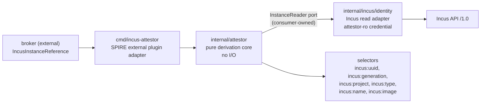

# P6 Frozen Reference Schema, Selector Set, and Plugin Boundary

**Captured:** 2026-08-16 16:39 PDT
**Host the observations come from:** `ovh-incusos` (`147.135.105.83:8443`), IncusOS, Incus server `7.3`, `server_clustered: false`
**Status:** **FROZEN.** Every field and selector below is traced to a specific authoritative Incus field with a captured value from [`EVIDENCE.md`](EVIDENCE.md) and its raw transcripts. Changes after this point need a new experiment, not an opinion.
**Scope note:** this document defines a boundary. It contains no Go code and no implementation.

## 1. Frozen reference schema — `IncusInstanceReference`

`type_url`: `type.googleapis.com/componere.incus.v1alpha1.IncusInstanceReference` (unchanged from the plan).
File target (Appendix C, gate P6): `proto/componere/incus/v1alpha1/reference.proto`.

This is the message a **broker** submits to the agent. It carries *claims*, never facts. Everything the attestor asserts as a selector is read back from Incus by the plugin.

| Field | Number | Type | Requirement | Meaning | Authoritative source it is checked against |
|---|---|---|---|---|---|
| `instance_uuid` | 1 | `string` (canonical UUID text) | **REQUIRED** | The only identity anchor. The instance to attest | instance config key `volatile.uuid` |
| `project` | 2 | `string` | OPTIONAL | Scopes the lookup. When empty the plugin uses its single configured project | instance record top-level `project` |
| `generation_uuid` | 3 | `string` (canonical UUID text) | OPTIONAL | An *expectation*, not an input: when set, the live generation MUST equal it or attestation fails. This is how a caller pins "the instance has not been rolled back since I minted this credential" | instance config key `volatile.uuid.generation` |
| `server` | 4 | `string` | OPTIONAL | An *expectation*, not routing: when set, it MUST equal the plugin's configured endpoint identity or attestation fails. It never selects which Incus to talk to | `GET /1.0` → `environment.certificate_fingerprint` (preferred) or `environment.server_name` |

The plan's working draft was `server`, `project`, `instance_uuid`, `generation_uuid`. **All four are kept, none added, none removed.** What changed is the *semantics*, and each change is forced by an observation:

| Change to the draft | Justification from observation |
|---|---|
| `instance_uuid` is the sole required field | A UUID resolves to a single instance record server-side in one call, with no name needed: `filter=config.volatile.uuid eq e9e6a2a0-d695-42d3-8e8c-92d290bfc7da` returned exactly `lab-c1r` ([`uuid-lookup-surface.txt`](uuid-lookup-surface.txt)) |
| `generation_uuid` demoted from "data" to "expectation that must match" | Restore keeps `volatile.uuid` and installs a **new random** generation every time (`c846f04c…` → `50dd028f…` → `f5468ef3…`; VM: `d6dc25da…` → `74957ed8…`). A caller cannot compute the current generation, so the only sound use of a client-supplied value is equality-check-or-fail |
| `server` demoted from "data" to "expectation that must match", and never used to choose an endpoint | The instance record contains **no** server identity on this deployment: `location` is `"none"` for every instance and `GET /1.0/cluster` returns `{"server_name": "", "enabled": false}`. Server identity exists only at the API level (`environment.server_name: "ns1001912.ip-147-135-105.us"`, `environment.certificate_fingerprint: "822b00ed474a2574d43223cbf34919b76a64946e145ec246aa4ae2e43318afdd"`). A client-supplied endpoint hint would be attacker-controlled routing with nothing to validate it against |
| `project` stays optional and defaults to plugin configuration | `project` is server-owned and resisted a direct PATCH (`{"project":"default"}` was ignored; the record still read `"project":"spike-uuid-lab"`). It is safe to *verify*, and a plugin confined to one project does not need the client to name it |
| Deliberately **not** in the message: `name`, `type`, `image`, `status` | These are derived by the plugin from the record. Accepting them from the client would let a caller assert metadata the attestor is supposed to prove. `name` is additionally reusable: after deleting `lab-c1r` and recreating the same name, the UUID went `c846f04c…` → `e9e6a2a0…` |

Wire-compatibility rules for the frozen message: field numbers 1–4 are permanent; new fields append from 5; no field is ever repurposed. `v1alpha1` may still break, but only via a new `type_url`, because the agent's `allowed_reference_types` pins the exact URL.

## 2. Frozen selector set

SPIRE selectors are `type:value`. The plugin's type is `incus`, so the emitted strings are `incus:<key>:<observed value>`. All six draft selectors survive.

| Selector | Emitted example (real captured value) | Authoritative source key | Behavior across the lifecycle matrix | Trust class |
|---|---|---|---|---|
| `incus:uuid` | `incus:uuid:e9e6a2a0-d695-42d3-8e8c-92d290bfc7da` | instance config `volatile.uuid` | Stable across stop/start, restart, rename, snapshot restore, host reboot. Fresh on create, copy, clone-from-snapshot, delete+recreate | **Anchor.** Format-validated by the server (`Error: Invalid config: Invalid UUID`) but **writable and not deduplicated** — see §3 |
| `incus:generation` | `incus:generation:74957ed8-19bc-4d23-b76b-763bb6f8bb60` | instance config `volatile.uuid.generation` | Equal to `volatile.uuid` at creation and after every copy. Replaced by a fresh random value on **every** snapshot restore. Never changed by stop/start, restart, or rename | **Rollback discriminator.** Writable; not regenerated when the uuid is regenerated |
| `incus:project` | `incus:project:spike-uuid-lab` | instance record top-level `project` | Constant for the instance's life on this deployment (project move not exercised — see §6) | **Strong.** Server-owned; PATCH-immutable |
| `incus:type` | `incus:type:container`, `incus:type:virtual-machine` | instance record top-level `type` | Constant; a clone keeps the source's type | **Strong.** Server-owned; PATCH-immutable; observed on both a container and a VM |
| `incus:name` | `incus:name:lab-c1r` | instance record top-level `name` | Changes on rename; reusable after delete | **Informational only** — exactly as the plan drafted. MUST NOT be used alone in a registration entry |
| `incus:image` | `incus:image:f005c3b83cc4ffe5b0e0a0c3fccdee6decbae5559fafce9861d9c8b3d2720a16` | instance config `volatile.base_image` | Preserved by copy (source and clones all reported the same fingerprint); matches a real `incus image info` fingerprint exactly | **Provenance only.** Writable, and Incus does **not** cross-check it against `type`: a container accepted the VM image fingerprint `9eb18b1a9368…`. Never an authorization anchor on its own |

### Selectors considered and rejected, with the observation that rejected them

| Rejected selector | Reason |
|---|---|
| `incus:status` | `status` is a lifecycle value (`Running`, `Stopped`) that changes on every stop/start (T1/T2, V1/V2). A registration entry matching on it would flap. The read stays in the port (P5 enumerated it) for **policy** decisions — e.g. refuse to attest a `Stopped` instance — but it is not published as a selector |
| `incus:location` | `location` is `"none"` for every instance on this non-clustered host, and `GET /1.0/cluster` reports `enabled: false`. Zero information, and no way to validate it here. Kept as a port read for a future cluster, never as a selector |
| `incus:server` | No per-instance server field exists (see §1). Server identity belongs to the plugin's configured endpoint, not to a selector |
| `incus:cloudinit-id` (`volatile.cloud-init.instance-id`) | Changed on **copy** (`80b6605c…` → `1640db69…`) and on **rename** (`80b6605c…` → `e17b46f4…`) while `volatile.uuid` held steady. Strictly less stable than the anchor |
| `incus:created-at` | Server-owned and survived rename (`2026-08-16T23:30:56.281412722Z`), but not unique by construction. Useful only as a corroborating tiebreaker in the duplicate-UUID case |
| Guest-reported DMI UUID | For VMs, `/sys/class/dmi/id/product_uuid` equals `volatile.uuid` — but it is rendered from the config value at boot and followed a tampered value, making two VMs report `8c19cbce-095a-4d91-af0b-78a59c58589d`. It is a claim, not corroboration |

## 3. Trust rules the derivation core MUST enforce (all forced by observation)

1. **Single match or fail.** UUID lookup returns a *list*. `volatile.uuid` uniqueness is a generation-time convention, not a server invariant: setting `lab-c2`'s uuid to `lab-c3`'s value was accepted and the filter query then returned **both** instances. Zero matches → fail. Two or more matches → fail, loudly, with the count. Never pick one.
2. **Never trust a client-asserted attribute.** Only `instance_uuid` selects; `project`, `generation_uuid`, and `server` are equality checks that can only *narrow* the outcome; everything else is read from Incus.
3. **Generation mismatch is a hard failure, not a warning.** Restore always produces a new generation, so a mismatch means the instance was rolled back after the credential was minted.
4. **No principal that can write instance config may be inside the attestation trust boundary.** `volatile.uuid`, `volatile.uuid.generation`, and `volatile.base_image` are all writable through the ordinary config surface, and a restart does not repair a tampered value. The attestor credential must be read-only; the bootstrap writer must be denied these keys explicitly (handed to P5 during the run, and P5 confirmed a plain `--restricted` TLS certificate is a full project operator that can itself spoof `volatile.uuid`).
5. **An empty or absent `volatile.uuid` is a failure, never a wildcard.** The key can be unset (it read back as `''` on a running container) and is only regenerated at the next start.
6. **Fail closed on Incus unavailability, with a bounded timeout.** Every derivation is one read; a hang must become a bounded attestation failure (P7 failure-isolation case 5).
7. **`incus:name` never appears alone in a registration entry.** Names are reusable across a delete+recreate that produces a different UUID.

## 4. Plugin boundary for durable code

Hexagonal per AGENTS.md A1–A4: a pure core with no I/O, one consumer-owned port for the Incus reads, one narrow adapter per external surface, and the SPIRE plugin binary as a thin outer adapter.

### 4.1 Proposed package layout under `componere/incusos-spire`

| Package / path | Role | Gate | Notes against AGENTS.md |
|---|---|---|---|
| `proto/componere/incus/v1alpha1/reference.proto` | The frozen `IncusInstanceReference` message from §1 and nothing else | **P6** | Schema only; generated code is not hand-edited |
| `internal/attestor` | The pure core: the instance-record value type, the reference value type, the selector value type, the derivation function, the trust rules of §3, and the **consumer-owned** `InstanceReader` port declaration | P7 | A1 (no I/O, testable without side effects), A3 (thin exported surface: the port, the record type, the derivation entry point; rules unexported), D4 `doc.go`, D1 on every type and field |
| `internal/attestor/mocks` | mockery-generated mock of `InstanceReader` | P7 | T2/T3 (never hand-written) |
| `internal/incus/identity` | The only adapter that reads instance state from Incus. Implements `InstanceReader` over `GET /1.0/instances?recursion=1&project=…&filter=config.volatile.uuid eq …` plus `GET /1.0` for endpoint identity. Links the read-only attestor credential and nothing else | P6/P7 | A2 (one purpose: identity reads — no create, delete, exec, or config write anywhere in it), I2 (returns a concrete client type, accepts interfaces) |
| `cmd/incus-attestor` | External SPIRE WorkloadAttestor plugin binary (SDK v1.15.2, `AttestReference`). Unmarshals the reference, calls the core, maps failures to gRPC codes, owns flags/config/logging | P7 | Thin adapter: no derivation logic, no direct Incus calls |
| `internal/incus/bootstrap` | Separate adapter for the `user.spiffe-bootstrap` write, with the writer credential. **Must not** import `internal/incus/identity` and must never write `volatile.*` | P8 | A2 again: split by credential, not by service |

`internal/broker`, `internal/nonce`, and `cmd/incus-spiffe-broker` stay exactly as Appendix C defines them; P6 does not touch their boundaries.

### 4.2 The `InstanceReader` port (consumer-owned, declared in `internal/attestor`)

One operation. It is deliberately not a wrapper around the Incus client surface (A2), and it returns the whole record in one call because the plugin needs all of P5's enumerated reads at once and must not issue a read-per-field.

| Aspect | Definition |
|---|---|
| Operation name | `ReadInstanceByUUID` |
| Inputs | a cancellation context; an instance-UUID domain type; a project-name domain type (empty means "the adapter's configured project") |
| Output | the instance record value type described below, plus an error |
| Multi-match contract | the adapter MUST NOT choose. If the server returns more than one instance for the UUID, the adapter returns the ambiguity sentinel and no record |
| Not-found contract | zero matches is the not-found sentinel, distinct from a transport error, so the plugin can answer "no selectors" instead of "backend broken" |
| Endpoint identity | a second, separate operation `ReadEndpointIdentity` returns the server name and the API certificate fingerprint from `GET /1.0`, used only to check the reference's optional `server` expectation |
| Purity | the port lives with its consumer; the core imports no Incus package, no `net/http`, and no clock beyond an injected one |

The record value type carries exactly the reads P5 enumerated, one field per authoritative source, using domain types rather than bare strings (I1 — e.g. distinct named string types for instance UUID, generation UUID, project name, image fingerprint, and a small enumerated instance-type value, not `string` everywhere):

| Record field | Source | Captured example |
|---|---|---|
| existence (the record itself) | one match on `filter=config.volatile.uuid eq <uuid>` | `lab-c1r` for `e9e6a2a0-d695-42d3-8e8c-92d290bfc7da` |
| instance UUID | config `volatile.uuid` | `e9e6a2a0-d695-42d3-8e8c-92d290bfc7da` |
| generation UUID | config `volatile.uuid.generation` | `74957ed8-19bc-4d23-b76b-763bb6f8bb60` |
| project | record `project` | `spike-uuid-lab` |
| type | record `type` | `container`, `virtual-machine` |
| status | record `status` | `Running`, `Stopped` — policy input, not a selector |
| location | record `location` | `none` on this non-clustered host — carried for a future cluster, not a selector |
| image fingerprint | config `volatile.base_image` | `f005c3b83cc4ffe5b0e0a0c3fccdee6decbae5559fafce9861d9c8b3d2720a16` |
| created at | record `created_at` | `2026-08-16T23:32:37.236591866Z` — corroboration only |

### 4.3 Failure taxonomy (E1: high-level sentinels the plugin maps to gRPC codes)

| Condition | Sentinel intent | Observed basis |
|---|---|---|
| No instance for the UUID | not found → plugin returns no selectors and no SVID | `Error: Failed to fetch instance "lab-c1r" in project "spike-uuid-lab": Instance not found` after delete |
| More than one instance for the UUID | ambiguous reference → hard failure | Two instances returned for `f09e831b-fd6a-40fa-928a-d13c35d5959e` after the duplicate-UUID probe |
| Live generation differs from the reference's `generation_uuid` | rollback detected → hard failure | Every restore produced a new generation (`50dd028f…`, `f5468ef3…`, `74957ed8…`) |
| Reference `server` differs from the adapter's endpoint identity | wrong-endpoint claim → hard failure | Endpoint identity exists only at `GET /1.0` (`822b00ed47…`), never in the instance record |
| Instance found but `volatile.uuid` empty, or status disallowed by policy | unusable record → hard failure | `volatile.uuid` read back as `''` after `config unset` |
| Incus unreachable, TLS rejected, or slow | backend failure, bounded by timeout, retried only for genuinely transient transport errors (E3) | P7 failure-isolation case 5 |

### 4.4 Tests the boundary implies (T1, and only for contracts P6 froze)

Unit tests over the pure core with fixed instance records: the six selectors are emitted with the exact strings in §2; a rename-shaped record changes only `incus:name`; a clone-shaped record changes `incus:uuid`, `incus:generation`, and nothing else; a restore-shaped record changes only `incus:generation`; a two-match lookup fails; a generation mismatch fails; an empty `volatile.uuid` fails. Adapter integration tests use the generated `InstanceReader` mock. No test asserts on live host state.

## 5. Traceability index

Every schema field and selector, back to the command that produced its value.

| Element | Source key | Command that captured it | Raw evidence |
|---|---|---|---|
| `instance_uuid`, `incus:uuid` | `volatile.uuid` | `incus query "ovh-incusos:/1.0/instances/lab-c1r?project=spike-uuid-lab"` | [`container-authoritative-fields.txt`](container-authoritative-fields.txt), [`container-matrix.txt`](container-matrix.txt), [`vm-matrix.txt`](vm-matrix.txt) |
| `generation_uuid`, `incus:generation` | `volatile.uuid.generation` | same query, before/after `incus snapshot restore` | [`container-matrix.txt`](container-matrix.txt) T4b/T4c, [`vm-matrix.txt`](vm-matrix.txt) V3b |
| `project`, `incus:project` | record `project` | same query; immutability probe via `incus query … -X PATCH` | [`container-authoritative-fields.txt`](container-authoritative-fields.txt), [`uuid-writability.txt`](uuid-writability.txt) |
| `incus:type` | record `type` | same query on a container and on a VM | [`container-authoritative-fields.txt`](container-authoritative-fields.txt), [`vm-matrix.txt`](vm-matrix.txt) |
| `incus:name` | record `name` | same query, before and after `incus rename` | [`container-matrix.txt`](container-matrix.txt) T6a |
| `incus:image` | `volatile.base_image` | `incus config show … --expanded`; `incus image info f005c3b83cc4…` / `9eb18b1a9368…` | [`server-and-image-fields.txt`](server-and-image-fields.txt) |
| `server` expectation | `GET /1.0` `environment.server_name`, `environment.certificate_fingerprint`; `GET /1.0/cluster` | `incus query ovh-incusos:/1.0`, `incus query ovh-incusos:/1.0/cluster` | [`server-and-image-fields.txt`](server-and-image-fields.txt) |
| Lookup contract (`recursion=1` + `filter`) | `GET /1.0/instances` | `incus query "ovh-incusos:/1.0/instances?recursion=1&project=…&filter=config.volatile.uuid%20eq%20…"` | [`uuid-lookup-surface.txt`](uuid-lookup-surface.txt) |
| Trust rules §3 | config write surface | `incus config set/unset` probes on `volatile.uuid`, `volatile.uuid.generation`, `volatile.base_image` | [`uuid-writability.txt`](uuid-writability.txt), [`uuid-inventory.txt`](uuid-inventory.txt) |

## 6. Not frozen by P6 — explicit open items

| Open item | Why it is open | Owner |
|---|---|---|
| Can a least-privilege credential perform the port's two reads? | P6 ran every read as the trusted admin remote, by batch contract. The recursive-list-with-filter call is the specific grant to verify | P5 / orchestrator re-run as `spike-attestor-ro` |
| Does moving an instance between projects preserve `volatile.uuid`? | Not exercised: P6 avoided creating a second project so it would not collide with P5's `spike-spiffe`. `incus:project` is therefore frozen as "constant for the instance's life *on this deployment*" | P10 (owns the migration proxies) |
| Cluster behavior of `location` and `server` | This host is `server_clustered: false`; every instance reports `location: "none"` | deferred until a real cluster exists |
| Whether the reference and the broker binary merge (decision D1) | Unchanged by P6; still an empirical P7/P8 decision | P7/P8 |
| `volatile.vsock_id` as a host↔guest channel binding | Observed to exist on VMs (`1189874259`); never evaluated | P8/P9 if needed |
